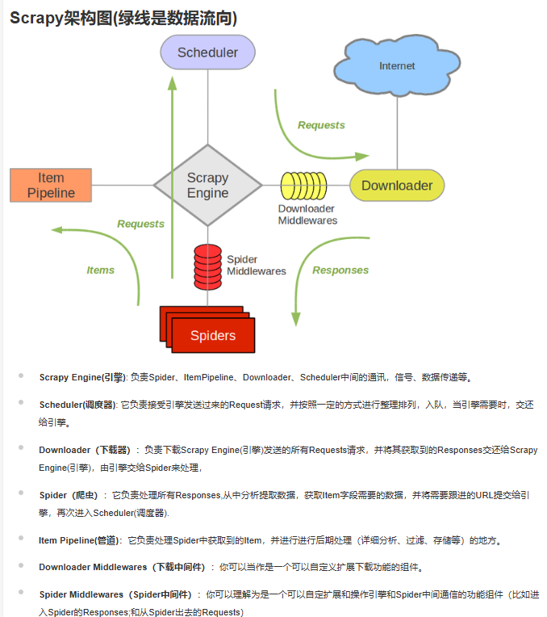
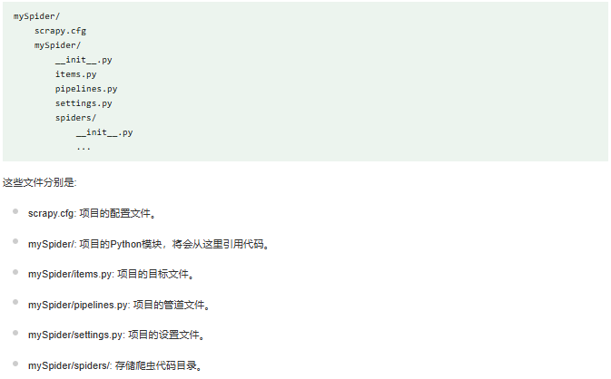

# Scrapy 项目简介

本项目基于 Scrapy 框架，用于抓取网页数据并进行处理。

## Scrapy 工作流程

1. **定义爬虫（Spiders）**:
   - 在 `scrapyprj/` 目录下创建爬虫脚本xxqg，定义抓取网页的规则和逻辑。

2. **发送请求（Requests）**:
   - 爬虫根据定义的规则向目标网站发送请求，获取网页数据。

3. **解析响应（Responses）**:
   - 使用Xpath解析器从响应中提取所需数据。

4. **存储数据（Items）**:
   - 将提取的数据存储在定义的数据结构（Items）中，在 `items.py` 中定义。

5. **数据处理（Pipelines）**:
   - 可选的数据处理步骤，如数据清洗、验证或存储到需要的数据库。在 `pipelines.py`，`mysqlpipelines.py`,`mongodbpipelines.py` 中定义,分别传入本地数据库，mysql和mongodb中

6. **设置文件（setting）**:
   - 配置并发量，下载延迟，request headers请求头等
   ```
   CONCURRENT_REQUESTS = 16 #最大并发量
   DOWNLOAD_DELAY = 25 #下载延迟
   DOWNLOAD_DELAY_RANDOMIZATION = 3
   ```
   - 其中ITEM_PIPELINES中可以设置各个pipeline通道的优先级，决定优先传输哪些数据库
```
ITEM_PIPELINES = {
    "scrapyprj.pipelines.ScrapyprjPipeline": 300,# 传到本地
    #"scrapyprj.mysqlpipelines.MySQLPipeline": 200,# 传到mysql
    #"scrapyprj.mongodbpipelines_jsonclassify.mongodbpipelines_jsonclassify": 200, #每日更新传到mongodb，记录日志
    "scrapyprj.mongodbpipelines_init_jsonclassfiy.MongoDBPipeline_init": 200, #初始传到mongodb，省去更新日志步骤
}
```

## 数据流向

- **发送请求 -> 接收响应 -> 解析数据 -> 存储数据**

## 创建爬虫

需要到项目所在目录 `/scrapyprj`, 运行指令

`scrapy genspider demo#爬虫名称 "www.xuexi.cn"#爬取网站域名`

创建爬虫文件，而不是直接创建py文件，否则会报错
## 运行爬虫

1. `cd scrapy` 转到项目所在路径
2. `scrapy crawl demo#爬虫名称` 运行爬虫
3. 如果想在pycharm中运行，创建 **start_xxqg.py**，代码如下
```
from scrapy import cmdline
cmdline.execute("scrapy crawl demo".split())
```
直接在命令行中输入 python start_xxqg.py 即可运行爬虫代码

## 操作流程

1. 初始化爬取

终端输入`scrapy crawl xxqg_init_all` 运行爬虫 **xxqg_init_all**，为避免给网站带来太大负担，建议分时分段爬取

`json_data_list = json_data_list_all[201:251]  #每次爬取部分内容` 

相应的,在setting中设置ITEM_PIPELINES选用mongodbpipelines_init通道（省去写入日志的步骤）避免引入太多数据，不需要执行的通道用 # 注释掉
```
ITEM_PIPELINES = {
    "scrapyprj.pipelines.ScrapyprjPipeline": 300,# 传到本地
    #"scrapyprj.mysqlpipelines.MySQLPipeline": 200,# 传到mysql
    #"scrapyprj.mongodbpipelines_jsonclassify.mongodbpipelines_jsonclassify": 200, #每日更新传到mongodb，记录日志
    "scrapyprj.mongodbpipelines_init_jsonclassfiy.MongoDBPipeline_init": 200, #初始传到mongodb，省去更新日志步骤
}
```
同时在**mongodbpipelines_init.py**中设置插入到相应的栏目集合

```
# 指定插入到 xxqg_1 集合中
self.db['xxqg_1'].insert_one
```
使用test_jsonlist.ipynb测试第一次爬取栏目时json列表中文章数量，根据文章数量调整爬虫代码
```
print(f"第 {index} 个JSON列表中的总项数为: {current_item_count}")

第 1 个JSON列表中的总项数为: 30212
第 2 个JSON列表中的总项数为: 462
第 3 个JSON列表中的总项数为: 5363
第 4 个JSON列表中的总项数为: 22646
```
- **注意：爬取完所有栏目的文章后，在mysql数据库jsonlist_count表中初始化每个'上一次json列表项数'**

2. 日常更新

编写脚本定时（比如每天）执行xxqg_json_classify.py实现爬取每日更新的文章，在xxqg_json_classify.py中，脚本读取在mysql数据库储存的上一次爬取时列表项目数量，并和当前读取栏目json列表中项目数量相比较，判断是否有新文章生成
```
新文章数量：articles_to_scrape = current_item_count - last_item_count
if 新文章数量 > 0：
   print(f"需要爬取最新的 {articles_to_scrape} 篇文章。")
   爬虫爬取相应文章
   根据json_index写入相应数据库
   更新日志
else
   print("没有发现新增的文章，无需爬取。")
```   
相应的,在setting中设置ITEM_PIPELINES选用mongodbpipelines_jsonclassify通道，不需要执行的通道用 # 注释掉
```
ITEM_PIPELINES = {
    #"scrapyprj.pipelines.ScrapyprjPipeline": 300,# 传到本地
    #"scrapyprj.mysqlpipelines.MySQLPipeline": 200,# 传到mysql
    "scrapyprj.mongodbpipelines_jsonclassify.mongodbpipelines_jsonclassify": 200, #每日更新传到mongodb，记录日志
    #"scrapyprj.mongodbpipelines_init_jsonclassfiy.MongoDBPipeline_init": 200, #初始传到mongodb，省去更新日志步骤
}
```
3. 注意事项

**注意安全爬取，在setting中限制下载延迟和最大并发量，分时分段爬取网页，避免给网站带来太大负担**





   
